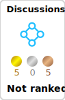

<!--
# GitHub Readme Stats を利用してGitHubプロフィールをカッコよくする
# https://qiita.com/zizi4n5/items/f8076cb25bbf64a9bc1c
# GitHub Readme Stats: https://github.com/anuraghazra/github-readme-stats/blob/master/docs/readme_ja.md
-->

<!-- # 統計情報を動的生成: 使えなくなった -->
<!--

-->

<!-- # 統計情報を動的生成 + アイコンの表示 + カウントにprivateリポジトリを含める + リポジトリのOwnerを表示: 使えなくなった(https://github.com/anuraghazra/github-readme-stats/issues/3851) -->
<!--

-->
<!-- # Top Languages Card: 使えなくなった(https://github.com/anuraghazra/github-readme-stats/issues/3851) -->
<!--

-->

<!--
https://githubcard.com/ を利用してGitHubプロフィールをカッコよくする
-->

<!-- # kaggleのバッジを表示。最初動かすときだけgithub actionの手動更新が必要だった。以後はpushしたら自動で走ってそう？ -->
<!-- https://github.com/riron1206/riron1206/actions/workflows/kaggle-badges.yml で github action のログ確認できる -->
<!-- 元コードは https://github.com/spider-man-tm/kaggle-badges/blob/main/docs/README.ja-jp.md  -->

  

  

<!--
  
  
  
-->
